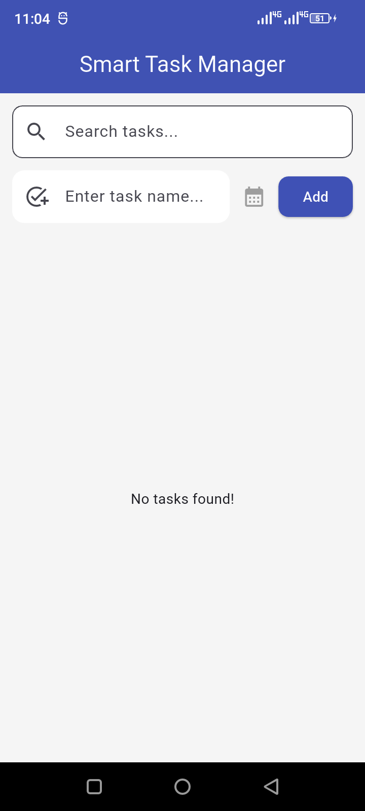
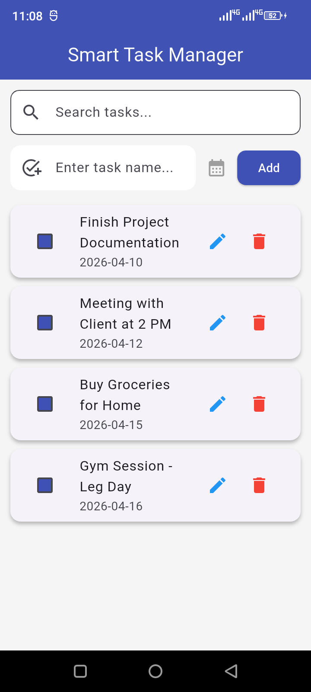
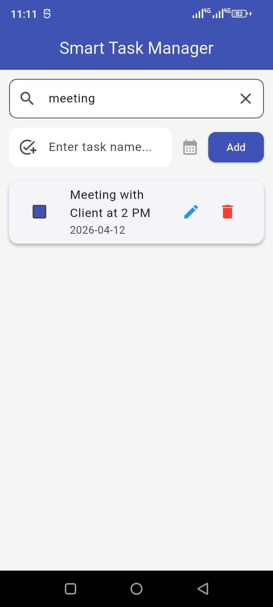
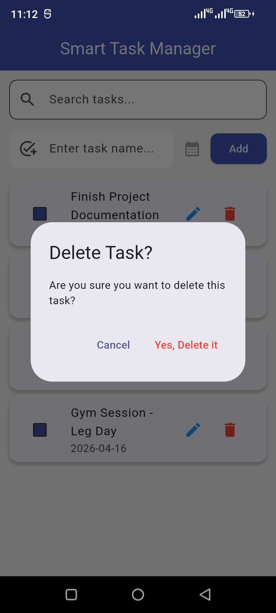

# 📝 Smart Task Manager - Flutter & SQLite


A professional-grade **Task Management System** built with **Flutter 3.27+**. This application features a robust offline-first architecture using **SQLite** for local data persistence, wrapped in a modern **Material 3** user interface.

---

### 📸 App Showcases


| 🏠 Home | 📋 Tasks | 🔍 Search | 🗑️ Delete |
| :---: | :---: | :---: | :---: |
|  |  |  |  |

---


## 🚀 Key Features

*   ✅ **Full CRUD Operations:** Seamlessly Create, Read, Update, and Delete tasks.
*   💾 **Local Persistence:** High-performance data storage using `sqflite` (Mobile) and `sqflite_common_ffi` (Desktop).
*   🔍 **Smart Filtering:** Instant real-time search logic to find tasks efficiently.
*   📅 **Deadline Management:** Integrated date picker for tracking task schedules.
*   🛡️ **Data Integrity:** Implementation of confirmation dialogs to prevent accidental deletions.
*   🎨 **Modern UI/UX:** Built with **Material 3** principles, featuring custom global theming and responsive cards.

---

## 🛠️ Technical Stack

*   **Framework:** [Flutter](https://flutter.dev) (v3.27+)
*   **Language:** Dart
*   **Database:** `sqflite` & `sqflite_common_ffi`
*   **Design System:** Material 3 Design Components
*   **Architecture:** Modular UI-State approach for clean code maintenance.

---

## ⚙️ Installation & Setup

1.  **Clone the Repository:**
    ```bash
    git clone https://github.com
    ```
2.  **Install Dependencies:**
    ```bash
    flutter pub get
    ```
3.  **Run the Project (Windows):**
    ```bash
    flutter run -d windows
    ```

---

## 📂 Project Directory Structure

```text
lib/
├── db/         # SQLite database helper & initialization
├── models/     # Task data model class (title, date, isDone)
├── screens/    # App UI Screens (HomeScreen, EditTaskScreen)
└── main.dart   # Global themes, Material 3 setup & app entry
```
---


# 👨‍💻 Developed By

**Jahngeer Khan**  
*Flutter Developer*


* **GitHub:** [Jahngeer](https://github.com/Jahngeer)

---
 >💡 *Passionate about building high-performance, offline-first mobile and desktop applications.*
